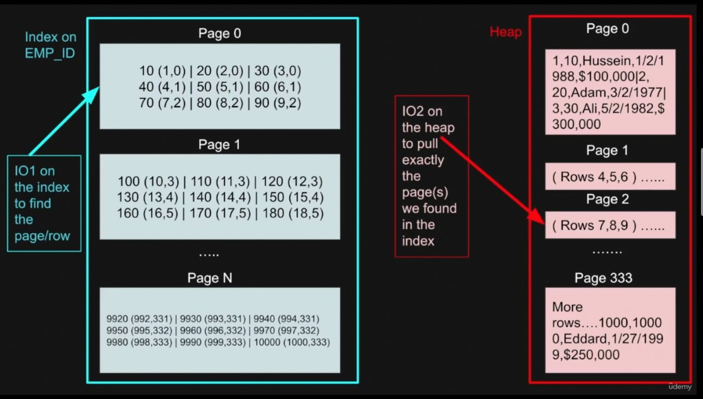
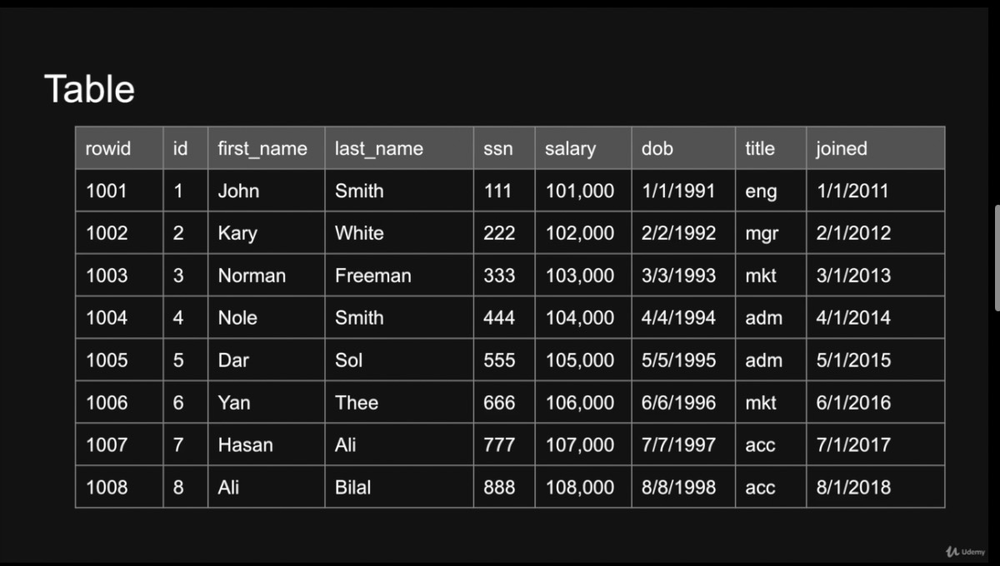
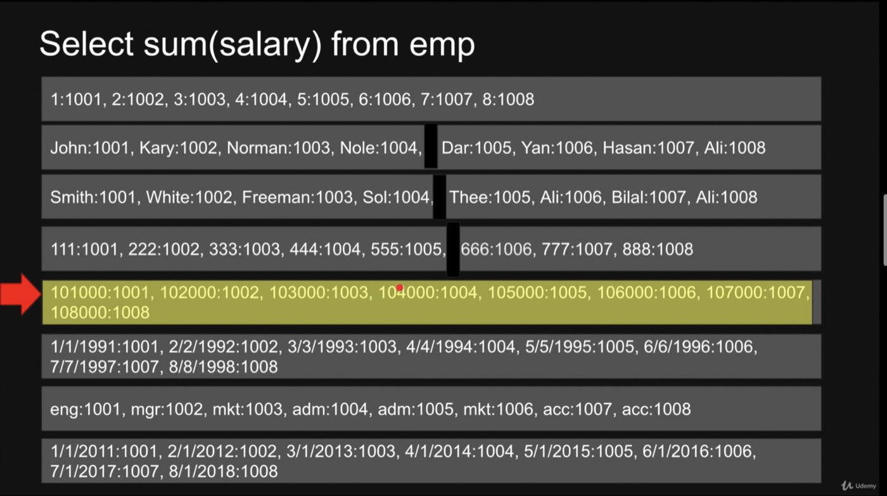

# مبانی مهندسی پایگاه‌داده (Database Engineering Fundamentals)

**مسیر یادگیری شخصی — فصل‌به‌فصل**

کتابچه اسکلت برای دنبال کردن کورس *Database Engineering Fundamentals*.
پیشرفت را علامت بزن. یادداشت فصل‌ها به‌مرور کامل می‌شود.

**سایت مستندات:** [ardavanshamroshan.github.io/database-engineering-fundumentals](https://ardavanshamroshan.github.io/database-engineering-fundumentals/)

**زبان:** فارسی · [English](README.md)

**چیت‌شیت‌ها:** [PostgreSQL](cheatsheets/postgresql.md) · [MySQL](cheatsheets/mysql.md) · [SQLite](cheatsheets/sqlite.md) · [Redis](cheatsheets/redis.md) · [MongoDB](cheatsheets/mongodb.md) · [Cassandra](cheatsheets/cassandra.md) · [ScyllaDB](cheatsheets/scylladb.md)

---

## پیشرفت

| وضعیت | تعداد |
| ----- | ----- |
| کل فصل‌ها | 17 |
| انجام‌شده | 0 |
| در حال انجام | — |

علامت‌ها: `[ ]` شروع‌نشده · `[~]` در حال انجام · `[x]` تمام‌شده

---

## نحوه استفاده

1. هر بار یک فصل بخوان (ترتیب زیر).
2. وقتی فصل تمام شد چک‌باکس را بزن.
3. یادداشت‌ها را زیر همان فصل اضافه کن.
4. اگر فقط موضوعات اصلی مهندسی را می‌خواهی، **01 / 15 / 16 / 17** را رد کن؛ برای کامل بودن در فهرست مانده‌اند.

**مسیر محلی مواد کورس:**

`/Users/ardavan/Documents/Coding/Tutorials/Database Engineering Fundumentals`

---

## فهرست مطالب

### بخش ۰ — متا

- [01 — به‌روزرسانی کورس](#01--بهروزرسانی-کورس)

### بخش ۱ — مبانی

- [02 — ACID](#02--acid)
- [03 — آشنایی با داخلیات پایگاه‌داده](#03--آشنایی-با-داخلیات-پایگاهداده)
- [04 — ایندکس‌گذاری](#04--ایندکسگذاری)
- [05 — B-Tree در برابر B+Tree](#05--b-tree-در-برابر-btree)

### بخش ۲ — مقیاس و توزیع

- [06 — پارتیشن‌بندی](#06--پارتیشنبندی)
- [07 — شاردینگ](#07--شاردینگ)
- [08 — کنترل همزمانی](#08--کنترل-همزمانی)
- [09 — Replication](#09--replication)

### بخش ۳ — سیستم‌ها و موتورها

- [10 — طراحی سیستم پایگاه‌داده](#10--طراحی-سیستم-پایگاهداده)
- [11 — موتورهای پایگاه‌داده](#11--موتورهای-پایگاهداده)
- [12 — Cursorها](#12--cursorها)

### بخش ۴ — امنیت

- [13 — امنیت پایگاه‌داده](#13--امنیت-پایگاهداده)
- [14 — رمزنگاری همومورفیک](#14--رمزنگاری-همومورفیک)

### بخش ۵ — اضافی

- [15 — پرسش و پاسخ](#15--پرسش-و-پاسخ)
- [16 — بحث‌های پایگاه‌داده](#16--بحثهای-پایگاهداده)
- [17 — لکتچرهای آرشیو](#17--لکتچرهای-آرشیو)

---

## فصل‌ها

### 01 — به‌روزرسانی کورس

- **وضعیت:** `[ ]`
- **خلاصه:** تغییرات و به‌روزرسانی مواد کورس.
- **تمرکز:** هم‌راستا ماندن با آخرین محتوای دوره.
- **یادداشت:** *(بعداً)*

---

### 02 — ACID

- **وضعیت:** `[ ]`
- **خلاصه:** چهار ویژگی تراکنش: Atomicity، Consistency، Isolation، Durability.
- **تمرکز:** تضمین‌های تراکنش در سیستم‌های رابطه‌ای.
- **یادداشت:**

ACID: **Atomicity**، **Consistency**، **Isolation**، **Durability**.

در سیستم‌های پایگاه‌داده رابطه‌ای، ACID یکپارچگی و سازگاری پایگاه‌داده را تضمین می‌کند.

#### تراکنش چیست؟ (What is a Transaction?)

تراکنش یعنی:

- گروهی از کوئری‌ها که به‌صورت یک واحد اجرا می‌شوند
- یک کار تجزیه‌ناپذیر (unit of work)
- مثال — انتقال پول بین حساب‌ها:
  - `SELECT`: بررسی کافی بودن موجودی حساب مبدأ
  - `UPDATE`: کم کردن موجودی حساب اول
  - `UPDATE`: زیاد کردن موجودی حساب دوم

```sql
START TRANSACTION;
SELECT * FROM account WHERE account_id = 1;
-- IF balance < 100 THEN ROLLBACK;
UPDATE account SET balance = balance - 100 WHERE account_id = 1;
UPDATE account SET balance = balance + 100 WHERE account_id = 2;
COMMIT;
```

اگر موجودی کافی نباشد → `ROLLBACK`؛ پایگاه‌داده در حالت قبلی می‌ماند.  
اگر کافی باشد → `COMMIT`؛ پایگاه‌داده به حالت جدید می‌رود.

برای امکان Undo، تغییرات اول در حافظه نوشته می‌شوند؛ فقط بعد از تأیید، به دیسک commit می‌شوند.

#### Atomicity (اتمی بودن)

تراکنش یک واحد اتمیک است که یا کامل موفق می‌شود یا کامل شکست می‌خورد. همه کوئری‌های داخل تراکنش باید با هم موفق یا با هم ناموفق باشند.

##### آزمایش: اثبات Atomicity با تراکنش ناتمام (PostgreSQL)

**هدف:** نشان بده تغییر commit‌نشده دائمی نمی‌شود. اگر session بدون `COMMIT` تمام شود، PostgreSQL تراکنش را rollback می‌کند — همه یا هیچ.

**انتظار ما**

| لحظه | `products.inventory` |
| ---- | -------------------- |
| قبل از `BEGIN` | `10` |
| داخل تراکنش باز، بعد از `UPDATE` | `0` (فقط در همین session دیده می‌شود) |
| بعد از قطع اتصال بدون `COMMIT` | دوباره `10` (rollback) |

**چرا این آزمایش Atomicity را ثابت می‌کند؟**

- داخل تراکنش موجودی را `0` می‌بینی.
- هرگز `COMMIT` نمی‌زنی.
- با خروج از `psql` تراکنش باز abort می‌شود → خودکار `ROLLBACK`.
- واحد کار کامل نشد → هیچ‌کدام از تغییراتش باقی نمی‌ماند.
- این همان Atomicity است: یا کامل موفق، یا طوری که انگار اصلاً اجرا نشده.

> **نکته:** اینجا غیرمستقیم Durability هم دیده می‌شود: فقط کار *commit‌شده* ماندگار است. کار commit‌نشده بعد از abort باید ناپدید شود.

**۱) آماده‌سازی**

```sql
CREATE DATABASE app;
\c app

CREATE TABLE products (
  id SERIAL PRIMARY KEY,
  name TEXT,
  price FLOAT,
  inventory INTEGER
);

CREATE TABLE sales (
  id SERIAL PRIMARY KEY,
  product_id INTEGER,
  price FLOAT,
  quantity INTEGER
);

INSERT INTO products (id, name, price, inventory)
VALUES (1, 'Phone', 999.99, 10);

SELECT * FROM products;
-- id=1, name=Phone, price=999.99, inventory=10
```

**۲) شروع تراکنش و تغییر موجودی (بدون commit)**

```sql
BEGIN;

UPDATE products SET inventory = inventory - 10;

SELECT * FROM products;
-- در همین session موجودی 0 است
```

**۳) خروج بدون `COMMIT`**

کلاینت را ببند (مثلاً خروج از `psql`) در حالی که تراکنش هنوز باز است. PostgreSQL آن را abort می‌کند.

**۴) اتصال دوباره و بررسی**

```sql
\c app
SELECT * FROM products;
-- موجودی دوباره 10 است
```

**نتیجه:** داخل تراکنش `UPDATE` واقعی به نظر می‌رسید، ولی بعد از abort پایگاه‌داده به حالت معتبر قبلی برگشت. واحد اتمیک = همه یا هیچ.

**گام اختیاری بعدی:** همین مراحل را تکرار کن، فقط قبل از خروج `COMMIT;` بزن. بعد از reconnect موجودی باید `0` بماند.

#### Consistency (سازگاری)

تراکنش باید پایگاه‌داده را از یک حالت معتبر به حالت معتبر دیگر ببرد.

- **سازگاری در داده (Consistency in data)**
  - توسط کاربر تعریف می‌شود
  - یکپارچگی ارجاعی (Referential integrity / foreign keys)
  - مرتبط با Atomicity تراکنش
  - مرتبط با Isolation تراکنش
- **سازگاری در خواندن (Consistency in reads)**
  - اگر تراکنشی تغییر را commit کرد، تراکنش جدید فوراً آن را می‌بیند؟
  - روی کل سیستم اثر دارد
  - هم رابطه‌ای و هم NoSQL با این موضوع روبه‌رو هستند
  - سازگاری نهایی (Eventual consistency)

#### Isolation (انزوا)

**Isolation Level** مشخص می‌کند تراکنش‌های هم‌زمان چه نسخه‌ای از دادهٔ هم را می‌بینند.

PostgreSQL از **MVCC** (کنترل همزمانی چندنسخه‌ای) استفاده می‌کند: معمولاً خواننده نویسنده را بلوکه نمی‌کند و برعکس. Isolation فقط تعیین می‌کند *کدام نسخه* سطر را می‌بینی.

مثال ساده: یک تراکنش `UPDATE` می‌زند، دیگری روی همان سطرها `SELECT` می‌کند. سطح Isolation تصمیم می‌گیرد خواننده نسخهٔ قدیمی را ببیند، منتظر بماند، یا snapshot ثابت از شروع تراکنش را ببیند.

سؤال: آیا تراکنش در حال اجرا می‌تواند تغییرات تراکنش‌های دیگر را ببیند؟

**تراکنش ۱:**

```sql
SELECT id, quantity FROM products WHERE id = 1;
SELECT SUM(quantity) FROM products;
```

**تراکنش ۲:**

```sql
UPDATE products SET quantity = quantity - 1 WHERE id = 1;
```

اگر Isolation نباشد، نتیجه می‌تواند غلط شود.

##### ناهنجاری‌های اصلی

**Dirty read (خواندن کثیف)** — تراکنش A داده را عوض کرده ولی هنوز commit نکرده. `SELECT` تراکنش B همان تغییرات معلق را می‌خواند. اگر A بعداً rollback کند، B از قبل دادهٔ نامعتبر دیده است.

**Non-repeatable read** — سطری را می‌خوانی؛ تراکنش دیگر UPDATE/DELETE را commit می‌کند؛ `SELECT` بعدی تو مقدار متفاوت (یا بدون سطر) می‌بیند.

**Phantom read (خواندن شبح)** — وسط `SELECT`های تراکنش A، تراکنش دیگری سطرهای مطابق شرط A را INSERT (یا DELETE) می‌کند. `SELECT` بعدی A مجموعهٔ متفاوتی می‌بیند.

| ناهنجاری | چه چیزی عوض شد؟ |
| -------- | --------------- |
| Dirty read | تغییرات **commit‌نشده** تراکنش دیگر را خواندی |
| Non-repeatable read | یک **سطر موجود** که قبلاً خوانده بودی **آپدیت** (یا حذف) شد |
| Phantom read | **مجموعه سطرهای** مطابق کوئری بزرگ/کوچک شد |

##### سطوح Isolation در PostgreSQL (نمای کلی)

| سطح | رفتار در PostgreSQL | Dirty | Non-repeatable | Phantom |
| --- | ------------------- | ----- | -------------- | ------- |
| **Read Uncommitted** | پذیرفته می‌شود، ولی مثل **Read Committed** عمل می‌کند (Dirty واقعی نیست) | 🟢 | 🔴 | 🔴 |
| **Read Committed** | **پیش‌فرض.** هر statement فقط دادهٔ commit‌شده قبل از شروع همان statement را می‌بیند | 🟢 | 🔴 | 🔴 |
| **Repeatable Read** | Snapshot از لحظهٔ شروع تراکنش؛ خواندن پایدار؛ معمولاً بدون phantom | 🟢 | 🟢 | 🟢 |
| **Serializable** | Snapshot + تشخیص تعارض (SSI)؛ ممکن است تراکنش با serialization failure abort شود | 🟢 | 🟢 | 🟢 |

> در PostgreSQL سطح جداگانه‌ای به نام **`SNAPSHOT`** نیست. **Repeatable Read** همان رفتار snapshot isolation را می‌دهد. **Serializable** قوی‌تر است (SSI).

##### آماده‌سازی آزمایش‌های PostgreSQL

دو session جدا در `psql` به دیتابیس `app` وصل کن (همان DB آزمایش Atomicity، یا بساز). یک‌بار:

```sql
CREATE DATABASE app;          -- اگر از قبل هست رد شو
\c app

DROP TABLE IF EXISTS test_table;
CREATE TABLE test_table (
  id SERIAL PRIMARY KEY,
  field1 INT,
  field2 INT,
  field3 INT
);

INSERT INTO test_table (field1, field2, field3) VALUES
  (1, 2, 3),
  (1, 2, 3),
  (1, 2, 3),
  (1, 2, 3);
```

برای فرصت سوییچ بین sessionها از `pg_sleep(10)` استفاده کن.

##### ۱) Read Uncommitted (در PostgreSQL = Read Committed)

در استاندارد SQL ضعیف‌ترین سطح است و می‌تواند Dirty read بدهد. **در PostgreSQL، `READ UNCOMMITTED` مثل `READ COMMITTED` رفتار می‌کند** — دادهٔ commit‌نشده session دیگر را نمی‌بینی.

**Session 1:**

```sql
BEGIN;
UPDATE test_table SET field1 = 2;
SELECT pg_sleep(10);
ROLLBACK;
```

**Session 2 (وسط sleep سشن ۱):**

```sql
SET TRANSACTION ISOLATION LEVEL READ UNCOMMITTED;
SELECT * FROM test_table;
```

هنوز مقادیر **قدیمی commit‌شده** را می‌بینی (`field1 = 1`)، نه `2`. Dirty read رخ نمی‌دهد. این رفتار عمدی PostgreSQL است.

##### ۲) Read Committed (پیش‌فرض)

هر statement فقط سطرهایی را می‌بیند که قبل از **شروع همان statement** commit شده‌اند. Dirty نمی‌بینی. بین statementهای یک تراکنش، UPDATEهای **commit‌شده** دیگران هنوز می‌توانند دید تو را عوض کنند → Non-repeatable / Phantom ممکن است.

**نمایش Non-repeatable read**

**Session 1:**

```sql
BEGIN;  -- پیش‌فرض = READ COMMITTED
SELECT * FROM test_table WHERE id = 1;
SELECT pg_sleep(10);
SELECT * FROM test_table WHERE id = 1;  -- بعد از commit سشن ۲ ممکن است فرق کند
COMMIT;
```

**Session 2 (وسط sleep):**

```sql
UPDATE test_table SET field1 = 7 WHERE id = 1;
-- در psql اگر تراکنش باز نکرده باشی auto-commit است
```

select اول سشن ۱: `field1 = 1`. بعد از commit سشن ۲، select دوم: `field1 = 7`. Non-repeatable read.

**خواننده در برابر نویسنده (MVCC):** معمولاً `SELECT` سشن ۲ پشت `UPDATE` باز سشن ۱ **گیر نمی‌کند** — نسخهٔ قبلی commit‌شده را می‌خواند. بلوکه عمدتاً وقتی دو writer روی یک سطر تعارض دارند پیش می‌آید.

##### ۳) Repeatable Read (snapshot)

PostgreSQL در شروع تراکنش یک **snapshot** می‌گیرد. همهٔ statementهای آن تراکنش همان حالت commit‌شده را می‌بینند. UPDATEهای commit‌شده دیگران وارد دید تو نمی‌شوند. INSERTهای phantom هم معمولاً **دیده نمی‌شوند**.

**Session 1:**

```sql
BEGIN;
SET TRANSACTION ISOLATION LEVEL REPEATABLE READ;
SELECT * FROM test_table WHERE id = 1;
SELECT pg_sleep(10);
SELECT * FROM test_table WHERE id = 1;  -- مثل select اول
COMMIT;
```

**Session 2 (وسط sleep):**

```sql
UPDATE test_table SET field1 = 7 WHERE id = 1;
```

هر دو select در سشن ۱ هنوز `field1` قدیمی را نشان می‌دهند. commit سشن ۲ به snapshot سشن ۱ نشت نمی‌کند.

اگر سشن ۱ بعداً همان سطری را `UPDATE` کند که سشن ۲ عوض کرده، ممکن است خطا بگیری: `could not serialize access due to concurrent update`.

##### ۴) Serializable (SSI)

قوی‌ترین سطح در PostgreSQL. مثل snapshot در Repeatable Read، به‌علاوه **تشخیص شکست سریال‌سازی**. اگر الگوی خطرناک هم‌زمانی دیده شود، یک تراکنش abort می‌شود و باید retry کند.

```sql
BEGIN;
SET TRANSACTION ISOLATION LEVEL SERIALIZABLE;
-- خواندن/نوشتن تو
COMMIT;
```

در تعارض ممکن است ببینی:

```text
ERROR: could not serialize access due to read/write dependencies among transactions
```

الگوی اپلیکیشن: خطا را بگیر → کل تراکنش را دوباره اجرا کن.

##### آزمایش Phantom read (PostgreSQL)

**Phantom read** وقتی است که تراکنش **همان کوئری را دو بار** اجرا کند و بار دوم **سطرهای جدید** مطابق `WHERE` ببیند — چون تراکنش دیگری INSERT مطابق را commit کرده است.

**آماده‌سازی (یک‌بار):**

```sql
\c app
DROP TABLE IF EXISTS products;
CREATE TABLE products (
  id SERIAL PRIMARY KEY,
  name TEXT,
  price FLOAT,
  inventory INTEGER
);
INSERT INTO products (name, price, inventory)
VALUES ('Phone', 999.99, 10);
```

**نمایش phantom زیر Read Committed**

**Session A:**

```sql
BEGIN;
SET TRANSACTION ISOLATION LEVEL READ COMMITTED;

SELECT COUNT(*) FROM products WHERE price > 500;
-- 1
SELECT pg_sleep(10);
SELECT COUNT(*) FROM products WHERE price > 500;
-- 2  ← phantom
COMMIT;
```

**Session B (وسط sleep):**

```sql
INSERT INTO products (name, price, inventory)
VALUES ('Laptop', 1299.00, 5);
```

**چه اتفاقی افتاد؟**

1. Session A شمارش `price > 500` → `1` (Phone).
2. Session B لپ‌تاپ (`1299`) را insert و commit کرد.
3. شمارش دوم Session A → `2`.
4. سطر اضافه همان **phantom** است.

**بستن phantom با Repeatable Read**

همان اسکریپت در Session A، ولی:

```sql
BEGIN;
SET TRANSACTION ISOLATION LEVEL REPEATABLE READ;
SELECT COUNT(*) FROM products WHERE price > 500;
SELECT pg_sleep(10);
SELECT COUNT(*) FROM products WHERE price > 500;
-- هنوز 1
COMMIT;
```

INSERT سشن B می‌تواند commit شود؛ snapshot سشن A تا قبل از commit خودش آن را نمی‌بیند.

##### Serializable در برابر Phantom Read

**Phantom read** = دو بار همان `SELECT`؛ بین دو اجرا INSERT/DELETE مطابق شرط؛ مجموعهٔ نتیجه عوض می‌شود.

| | Read Committed | Repeatable Read (PostgreSQL) | Serializable |
| - | -------------- | ---------------------------- | ------------ |
| UPDATEهای commit‌شده دیگران وسط تراکنش دیده می‌شود؟ | بله (per statement) | خیر (snapshot) | خیر (snapshot + SSI) |
| Phantom از INSERT؟ | 🔴 ممکن | 🟢 معمولاً بسته | 🟢 بسته |
| ممکن است تراکنش abort شود؟ | برای این مورد نادر | روی نوشتن متعارض همان سطر | روی تعارض تشخیص‌داده‌شده SSI |

**PostgreSQL چطور در Repeatable Read phantom را می‌بندد؟**

- Snapshot در `BEGIN` / اولین کوئری تراکنش RR ثابت می‌شود.
- INSERTهایی که بعد از آن snapshot commit شوند برای تو نامرئی‌اند.
- معمولاً به range lock به‌سبک بعضی موتورهای قفل‌محور نیاز نیست.

**کی Serializable؟**

- وقتی قواعد کسب‌وکار نیاز به اجرای واقعاً سریال دارند (مثلاً دو تراکنش هر کدام یک مجموعه را می‌خوانند و بر اساس آن می‌نویسند).
- انتظار `could not serialize access` گاه‌به‌گاه → retry.

**معنای Snapshot در برابر Serializable (PostgreSQL)**

- **Repeatable Read** ≈ snapshot isolation (دید پایدار؛ بدون Dirty / Non-repeatable / phantom معمول).
- **Serializable** = snapshot + بررسی وابستگی؛ برای الگوهای نوشتن پیچیده امن‌تر، احتمال retry بیشتر.

**پیاده‌سازی Isolation در پایگاه‌داده:**

- Isolation در PostgreSQL روی **MVCC** + snapshot (+ SSI برای Serializable) بنا شده
- موتورهای **Pessimistic** بیشتر روی قفل تکیه می‌کنند؛ خواننده‌های PostgreSQL بیشتر با نسخه کار می‌کنند
- مدیریت **Optimistic** وقتی writerهای RR/Serializable برخورد می‌کنند دیده می‌شود — fail و retry

#### Durability (دوام)

تراکنش پایدار است: بعد از commit، حتی با قطع برق یا کرش سیستم از بین نمی‌رود. تغییرات کلاینت باید ماندگار بمانند.

**Durability در عمل**

راهکارهای رایج:

- **Write-Ahead Logging (WAL)** — قبل از تغییر فایل‌های اصلی، تغییرات در لاگ ثبت می‌شود؛ بعد از کرش با replay لاگ، کار commit‌شده بازیابی می‌شود
- **Write-Through Logging (WTL)** — هم‌زمان به لاگ و پایگاه‌داده می‌نویسد؛ ریسک از دست رفتن داده کمتر و هم‌راستایی لاگ و storage بهتر
- **Write-Behind / Write-Back Logging (WBL)** — اول لاگ؛ به‌روزرسانی فایل اصلی عقب می‌افتد (اغلب batch). سریع‌تر است ولی recovery باید دقیق باشد
- **تفاوت DBMSها** — موتورها این استراتژی‌ها را با تعادل سرعت در برابر ایمنی ترکیب می‌کنند

لاگ‌گذاری تضمین می‌کند که بعد از commit، recovery بتواند دادهٔ آسیب‌دیده را بازسازی کند.

#### سازگاری نهایی (Eventual Consistency)

**Consistency** در ACID یعنی تراکنش پایگاه‌داده را از یک حالت معتبر به حالت معتبر دیگر می‌برد.

در سیستم‌های توزیع‌شده و بسیاری از NoSQLها، **Eventual consistency** رایج است: اگر به‌اندازه کافی بدون آپدیت جدید بگذرد، همه replicaها هم‌گرا می‌شوند — اما سازگاری فوری بعد از هر نوشتن تضمین نیست.

در راه‌اندازی‌های رابطه‌ای توزیع‌شده هم، وقتی اولویت Availability و Partition tolerance باشد، ممکن است دیده شود.

**نکات کلیدی:**

- Consistency در ACID یعنی اعمال قوانین یکپارچگی بعد از هر تراکنش
- Eventual consistency اختلاف موقت بین نودها را می‌پذیرد؛ با زمان هم‌گرا می‌شوند
- فقط مخصوص NoSQL نیست

**مثال**

Master به نام `A` و دو replica به نام `A1` و `A2`:

1. مقدار `X` روی master `A` آپدیت می‌شود
2. قبل از تمام شدن replication از `A1` می‌خوانی → مقدار قدیمی `X` (ناسازگاری موقت)
3. بعد از رسیدن آپدیت به `A1` و `A2`، همه نودها همان `X` به‌روز را دارند

سازگاری فوری تضمین نیست؛ وقتی replicaها sync شوند، سیستم در نهایت سازگار می‌شود.

---

### 03 — آشنایی با داخلیات پایگاه‌داده

- **وضعیت:** `[ ]`
- **خلاصه:** داده داخل پایگاه‌داده چطور ذخیره و پیدا می‌شود.
- **تمرکز:** پشت صحنه — storage، صفحات، ایندکس، و IO.

#### جدول و ایندکس چطور ذخیره و پیدا می‌شوند — ساده

**ایده‌های کلیدی ذخیره‌سازی:**

- **Table (جدول):** یک جدول شبکه‌ای از سطرها و ستون‌ها.

  *مثال:*

  | id | name    | email              |
  |----|---------|--------------------|
  | 1  | Alice   | alice@email.com    |
  | 2  | Bob     | bob@email.com      |
  | 3  | Charlie | charlie@email.com  |

  هر سطر یک رکورد است. ستون‌ها فیلدهای داده هستند.

  *نمونه کد PostgreSQL:*
  ```sql
  CREATE TABLE users (
    id SERIAL PRIMARY KEY,
    username VARCHAR(50) NOT NULL,
    email VARCHAR(100) UNIQUE NOT NULL,
    created_at TIMESTAMP DEFAULT NOW()
  );
  ```

- **Row ID:** هر سطر یک شناسه یکتا دارد تا پایگاه‌داده سریع همان سطر را پیدا کند. گاهی primary key است؛ گاهی (مثل PostgreSQL) یک مقدار سیستمی پنهان.

- **Page (صفحه):** پایگاه‌داده داده را در «صفحه» جابه‌جا می‌کند — تکه‌هایی معمولاً 8KB یا 16KB. یک صفحه چند سطر نگه می‌دارد. وقتی می‌خواند، کل صفحه را می‌گیرد نه تک‌سطر.

    - مثال: اگر هر صفحه ۳ سطر جا بدهد و جدول ۱٬۰۰۱ سطر داشته باشد، حدود ۳۳۴ صفحه لازم است.

- **IO (Input/Output):** خواندن/نوشتن بین حافظه و دیسک/SSD. هر IO حداقل یک صفحه کامل می‌خواند، نه یک سطر تکی. IO زیاد = پایگاه‌داده کند.

- **Heap:** روش سادهٔ ذخیرهٔ سطرهای جدول: هر سطر را در اولین جای خالی می‌گذارد (بدون مرتب‌سازی). Insert سریع است، ولی جستجو بدون کمک کند است.

    - برای پیدا کردن سریع بدون گشتن همه‌جا، نیاز داری به...

- **Index (ایندکس):** مثل نقشه است که مستقیم به سطر(ها) در جدول (همان «Heap») اشاره می‌کند. اغلب به‌صورت **B-Tree** یا **B+Tree** — درخت‌های مرتب که جستجو را خیلی سریع می‌کنند.

    - **ایندکس چطور کار می‌کند:**
      1. ایندکس دادهٔ کلید (بعضی ستون‌ها) را نگه می‌دارد.
      2. برای هر کلید، pointer به محل در Heap دارد (کدام صفحه، کدام سطر).
      3. در ایندکس جستجو می‌کنی؛ پایگاه‌داده دقیق می‌فهمد رکورد کجاست — بدون اسکن کل جدول.

    - **نکات ایندکس:**
        - می‌تواند یک یا چند ستون را پوشش دهد (موقع ساخت انتخاب می‌کنی).
        - مثل جدول در صفحه ذخیره می‌شود، ولی معمولاً کوچک‌تر و حافظه‌دوست‌تر است.
        - رایج‌ترین ساختار: **B-Tree** یا **B+Tree**.

    - **تصویر ذهنی:**
      ```
      [Index on email]
           |
       "bob@email.com"
           |
      points to
           |
      [Heap Page X] → Row for Bob
      ```

**جمع‌بندی:**
- داده در جدول‌ها ذخیره می‌شود (سطر و ستون).
- هر سطر داخل یک صفحه می‌نشیند.
- پایگاه‌داده صفحه جابه‌جا می‌کند، نه تک‌سطر.
- Heap سطرها را هر جا جا باشد می‌چیند.
- ایندکس کمک جستجو است — مستقیم به داده اشاره می‌کند تا همهٔ سطرها را نگردی.



**نمودار — جستجو با ایندکس در برابر خواندن از Heap**

1. **IO1 روی ایندکس:** در ایندکس `EMP_ID` بگرد تا pointer به شکل `(page_id, row_id)` پیدا شود.
2. **IO2 روی Heap:** با همان pointer صفحهٔ درست Heap را بخوان و کل سطر را بگیر.

در PostgreSQL هم ایده یکی است: ایندکس ثانویه کلید + اشاره‌گر به tuple در Heap (`ctid`) را نگه می‌دارد؛ معمولاً حداقل یک IO ایندکس + یک IO Heap.

- **مثال کوئری:**  
  فرض کن جدول employees با ایندکس روی `email` داری.

  - **کوئری:**  
    ```sql
    SELECT * FROM employees WHERE email = 'bob@email.com';
    ```

  - **فقط Heap (بدون ایندکس):**  
    پایگاه‌داده باید همهٔ سطرها را اسکن کند تا ایمیل Bob را پیدا کند. اگر ۱۰٬۰۰۰ سطر باشد، همه را چک می‌کند (ممکن است صدها صفحه!). برای جدول بزرگ خیلی کند است.

  - **با ایندکس:**  
    1. اول `'bob@email.com'` را در **ایندکس** پیدا می‌کند (سریع، معمولاً ۱ یا ۲ صفحه).
    2. ایندکس دقیق می‌گوید کدام صفحه و سطر Heap دادهٔ Bob را دارد.
    3. مستقیم همان‌جا می‌پرد و فقط همان صفحه را برای کل سطر می‌خواند.
    4. نتیجه: به‌جای اسکن همه چیز، معمولاً فقط ۲ خواندن (IO). خیلی سریع‌تر!

  #### پایگاه‌داده Row-Oriented در برابر Column-Oriented

- **Row-Oriented (ذخیره‌سازی سطری / Row Store):**  
  - کل هر سطر را کنار هم در هر بلوک دیسک نگه می‌دارد؛ همهٔ ستون‌های یک سطر کنار هم هستند.
  - خواندن یک بلوک، سطرهای کامل را یکجا می‌دهد (همهٔ ستون‌ها و مقادیرشان برای هر سطر).
  - اسکن برای پیدا کردن سطر خاص ممکن است چند IO ببرد، ولی وقتی سطر پیدا شد همهٔ داده‌اش با هم لود می‌شود.
  - بهترین برای:
    - سیستم‌های تراکنشی (OLTP) که اغلب کل سطر را می‌خوانند یا می‌نویسند (مثلاً insert/update رکورد).
    - بارهایی که برای join یا تغییر، یکپارچگی سطر مهم است.
    - مثال سیستم‌ها: PostgreSQL، MySQL، SQLite و غیره.
    - مثال جدول (ذخیرهٔ سطری):
      | id | name    | email              |
      |----|---------|--------------------|
      | 1  | Alice   | alice@email.com    |
      | 2  | Bob     | bob@email.com      |
      | 3  | Charlie | charlie@email.com  |



- **Column-Oriented (ذخیره‌سازی ستونی / Column Store):**  
  - همهٔ مقادیر هر ستون را در بلوک‌های جدا (تکه‌های ستونی) نگه می‌دارد؛ پس مقادیر یک ستون از نظر فیزیکی کنار هم هستند.
  - خواندن یک بلوک، مقادیر زیاد از **یک** ستون می‌دهد، نه سطر کامل.
  - گرفتن همهٔ مقادیر یک ستون (برای فیلتر یا aggregation) خیلی سریع و کارآمد است — ممکن است فقط چند بلوک لازم باشد. ولی بازسازی سطر کامل از روی چند ستون می‌تواند IO بیشتری بخواهد.
  - بهترین برای:
    - بارهای تحلیلی (OLAP) مثل گزارش، aggregation، و فیلتر روی جدول‌های خیلی بزرگ.
    - وقتی معمولاً فقط چند ستون را یکجا پردازش می‌کنی، یا می‌خواهی مجموعهٔ بزرگ را ستونی اسکن کنی.
    - مثال سیستم‌ها: ClickHouse، Amazon Redshift، Vertica، Apache Parquet و غیره.
    - مثال (نمای ساده) — ستون‌ها جدا ذخیره شده‌اند:
      ```
      id:    [1,   2,    3,    ...]
      name:  [Alice, Bob, Charlie, ...]
      email: [alice@email.com, bob@email.com, charlie@email.com, ...]
      ```

#### مزایا و معایب

| پایگاه‌داده Row-Oriented | پایگاه‌داده Column-Oriented |
| ------------------------ | --------------------------- |
| سریع برای خواندن/نوشتن تراکنشی (سطر کامل) | کندتر برای نوشتن، مخصوصاً وقتی ستون‌های زیاد یکجا تغییر کنند |
| مناسب OLTP (تراکنش، آپدیت مکرر) | مناسب OLAP (آنالیتیکس، aggregation، گزارش) |
| فشرده‌سازی داده معمولاً ضعیف‌تر | فشرده‌سازی عالی (شباهت مقادیر یک ستون) |
| برای aggregation کم‌بازده | برای aggregation، فیلتر، اسکن چند ستون بسیار کارآمد |
| برای کوئری‌هایی که خیلی/همهٔ ستون‌های یک سطر را می‌خواهند کارآمد | برای point query که سطر کامل می‌خواهد کم‌بازده |




### 04 — ایندکس‌گذاری

- **وضعیت:** `[ ]`
- **خلاصه:** پیدا کردن سریع‌تر سطرها، انتخاب ایندکس برای کوئری‌های واقعی و سنجش نتیجه.
- **تمرکز:** روش‌های خواندن داده، ستون‌های کلیدی و پوششی، انواع ایندکس و هزینهٔ خواندن و نوشتن.

**هدف یادگیری:** در پایان این فصل بتوانید توضیح دهید چرا یک کوئری از ایندکس استفاده می‌کند، ایندکس مناسبی بسازید و تأثیر آن را بسنجید.

#### ۱. ایندکس چه کاری انجام می‌دهد؟

ایندکس را مثل نمایهٔ یک کتاب در نظر بگیرید: موضوع موردنظر را بدون خواندن همهٔ صفحه‌ها پیدا می‌کنید. در PostgreSQL، سطرهای جدول در **Heap** ذخیره می‌شوند و ایندکس ساختاری جداگانه است که به آن سطرها اشاره می‌کند.

**B-Tree**، نوع پیش‌فرض ایندکس، کلیدها را به‌ترتیب و همراه با ارجاع به سطرهای Heap نگه می‌دارد. این ساختار برای تساوی (`=`)، بازه‌ها (`>` و `BETWEEN`) و عبارت‌های سازگار با `ORDER BY` مفید است. ساختن آن، خود جدول را مرتب نمی‌کند.


**هزینه و فایده:** ایندکس می‌تواند کار لازم برای خواندن را کاهش دهد، اما فضای دیسک می‌گیرد و هزینهٔ نوشتن و نگهداری را افزایش می‌دهد. آن را برای کوئری‌هایی بسازید که واقعاً به بهبود سرعت نیاز دارند.

#### ۲. تمرین: مقایسهٔ کوئری قبل و بعد از ساخت ایندکس

از یک پایگاه‌دادهٔ تمرینی PostgreSQL استفاده کنید. بلوک‌ها را به‌ترتیب، در یک نشست و با فعال بودن autocommit اجرا کنید. جدول موقت با قطع اتصال حذف می‌شود؛ برای تکرار تمرین، نشست تازه‌ای باز کنید.

**گام اول: ساخت ۱۰۰٬۰۰۰ سطر.**

```sql
CREATE TEMP TABLE indexing_employees (
  id integer PRIMARY KEY,
  name text NOT NULL,
  email text NOT NULL,
  department_id integer NOT NULL,
  active boolean NOT NULL
);

INSERT INTO indexing_employees
SELECT n,
       'User ' || n,
       'user' || n || '@example.com',
       n % 100,
       n % 10 = 0
FROM generate_series(1, 100000) AS g(n);

ANALYZE indexing_employees;
```

کلید اصلی، یک B-Tree یکتا روی `id` می‌سازد؛ برای `email` ایندکسی ایجاد نمی‌کند. دستور `ANALYZE` آمار داده‌ها را در اختیار برنامه‌ریز کوئری قرار می‌دهد.

**گام دوم: سنجش جست‌وجوی ایمیل بدون ایندکس ایمیل.**

```sql
EXPLAIN (ANALYZE, BUFFERS)
SELECT id, name
FROM indexing_employees
WHERE email = 'user50000@example.com';
```

انتظار می‌رود **Seq Scan** ببینید: PostgreSQL جدول را می‌خواند و سطرهای نامرتبط را کنار می‌گذارد. برنامهٔ اجرا و زمان آن را یادداشت کنید.

**گام سوم: ساخت ایندکس و اجرای دوبارهٔ همان کوئری.**

```sql
CREATE INDEX indexing_employees_email_idx
ON indexing_employees (email);

EXPLAIN (ANALYZE, BUFFERS)
SELECT id, name
FROM indexing_employees
WHERE email = 'user50000@example.com';
```

انتظار می‌رود **Index Scan** ببینید: ایمیل در ایندکس پیدا می‌شود، سپس `id` و `name` از Heap خوانده می‌شوند. میزان کار و زمان اجرا را با گام دوم مقایسه کنید.

برنامه و زمان اجرا به داده‌ها، تنظیمات و وضعیت کش بستگی دارند. هر کوئری را چند بار اجرا و نتایج را در شرایط مشابه مقایسه کنید؛ انتظار ضریب افزایش سرعت ثابتی نداشته باشید.

#### ۳. خواندن برنامهٔ اجرای کوئری

| روش اجرا | شیوهٔ دریافت داده | کاربرد رایج |
| --- | --- | --- |
| **Seq Scan** | صفحه‌های جدول را می‌خواند و شرط را بررسی می‌کند. | جدول کوچک یا کوئری با تعداد زیادی سطر خروجی. |
| **Index Scan** | ورودی‌های ایندکس را پیدا می‌کند، سپس به Heap مراجعه می‌کند. | جست‌وجوی محدود با نیاز به ستون‌های خارج از ایندکس. |
| **Index Only Scan** | مقدارها را از ایندکس می‌گیرد؛ وضعیت رؤیت‌پذیری را بررسی می‌کند و ممکن است به Heap مراجعه کند. | کوئری‌هایی که ستون‌های موردنیازشان در ایندکس موجود است. |
| **Bitmap Index Scan + Bitmap Heap Scan** | محل سطرها را جمع‌آوری می‌کند، سپس صفحه‌های Heap را به‌ترتیب می‌خواند. | دریافت چندین سطر یا ترکیب چند ایندکس. |

ابتدا این بخش‌های خروجی را بررسی کنید:

- **Index Cond:** شرطی که برای جست‌وجو در ایندکس استفاده شده است.
- **Filter / Rows Removed by Filter:** بررسی و حذف سطرها پس از دریافت سطرهای احتمالی.
- **تعداد سطرهای تخمینی و واقعی:** اختلاف زیاد می‌تواند نشانهٔ آمار قدیمی یا دشواری تخمین توزیع داده‌ها باشد.
- **Buffers:** دسترسی به صفحه‌ها از حافظه یا با خواندن داده؛ این عدد، تعداد صفحه‌های یکتا یا عملیات فیزیکی دیسک نیست.
- **Heap Fetches:** تعداد مراجعه‌ها به Heap در اسکن فقط ایندکس. صفر یعنی آن اجرا به مراجعه به Heap نیاز نداشته است.
- **Execution Time:** زمان اجرای کوئری اندازه‌گیری‌شده؛ هزینهٔ تخمینی برنامه‌ریز جداست و برحسب میلی‌ثانیه نیست.

`EXPLAIN` تخمین‌ها را نشان می‌دهد. `EXPLAIN ANALYZE` دستور را **واقعاً اجرا می‌کند**؛ تغییرات دستورهای `INSERT`، `UPDATE` و `DELETE` نیز اعمال می‌شوند.

#### ۴. ستون‌های کلیدی و ستون‌های پوششی

**ستون‌های کلیدی** مسیر جست‌وجو و ترتیب ایندکس را تعیین می‌کنند. **ستون‌های پوششی** که با `INCLUDE` اضافه می‌شوند، مقدارهای لازم برای خروجی را نگه می‌دارند؛ در ترتیب جست‌وجو یا شرط یکتایی نقشی ندارند.

در `WHERE email = ...`، ستون `email` کلید جست‌وجو است. برای برگرداندن `id` و `name` بدون خواندن مقدار آن‌ها از Heap، ایندکس تمرین را با یک **ایندکس پوششی** جایگزین کنید:

```sql
DROP INDEX indexing_employees_email_idx;

CREATE INDEX indexing_employees_email_cover_idx
ON indexing_employees (email) INCLUDE (id, name);

VACUUM (ANALYZE) indexing_employees;

EXPLAIN (ANALYZE, BUFFERS)
SELECT id, name
FROM indexing_employees
WHERE email = 'user50000@example.com';
```

اکنون **Index Only Scan** امکان‌پذیر است. PostgreSQL همچنان بررسی می‌کند که هر سطر برای تراکنش قابل‌رؤیت باشد. `VACUUM` می‌تواند در **نقشهٔ رؤیت‌پذیری** (visibility map)، صفحه‌های Heap را برای همهٔ تراکنش‌ها قابل‌رؤیت علامت بزند؛ در این صورت مراجعه به Heap لازم نیست. نوشتن‌های تازه ممکن است دوباره بررسی Heap را ضروری کنند.

| تعریف ایندکس | کلیدهای جست‌وجو و ترتیب | مقدارهای اضافی ذخیره‌شده |
| --- | --- | --- |
| `(email)` | `email` | ندارد |
| `(email, id)` | ابتدا `email`، سپس `id` | ندارد |
| `(email) INCLUDE (id, name)` | `email` | `id` و `name` |

ایندکس یکتا روی `(email) INCLUDE (id)`، فقط یکتایی **email** را تضمین می‌کند. اضافه کردن همهٔ ستون‌ها با `INCLUDE` می‌تواند هزینهٔ ایندکس را بالا ببرد؛ اسکن فقط ایندکس لزوماً سریع‌تر نیست.

#### ۵. سه راهکار کاربردی برای طراحی ایندکس

مثال‌های زیر ادامهٔ همان تمرین هستند. هرکدام برای الگوی کوئری متفاوتی کاربرد دارند.

**ایندکس ترکیبی: فیلتر و مرتب‌سازی هم‌زمان.**

```sql
CREATE INDEX indexing_employees_department_id_idx
ON indexing_employees (department_id, id);

EXPLAIN (ANALYZE, BUFFERS)
SELECT id
FROM indexing_employees
WHERE department_id = 42
ORDER BY id
LIMIT 20;
```

ایندکس، سطرها را بر اساس دپارتمان گروه‌بندی می‌کند و در هر گروه، ترتیب `id` را نگه می‌دارد. برای این کوئری، ستون شرط تساوی را اول و ستون مرتب‌سازی را بعد قرار دهید. جست‌وجوی صرفاً `id` معمولاً با ایندکس موجود کلید اصلی بهتر انجام می‌شود. گاهی ستون‌های بعدی بدون شرط روی ستون اول هم قابل‌استفاده‌اند؛ برای نمونه، PostgreSQL 18 از skip scan پشتیبانی می‌کند. قاعدهٔ ستون اول را مطلق ندانید و نتیجه را بسنجید.

**ایندکس جزئی: فقط سطرهای موردنیاز را ایندکس کنید.**

```sql
CREATE INDEX indexing_employees_active_id_idx
ON indexing_employees (id) WHERE active;

EXPLAIN (ANALYZE, BUFFERS)
SELECT id
FROM indexing_employees
WHERE active
ORDER BY id
LIMIT 20;
```

فقط ۱۰٪ سطرهای تمرین فعال‌اند؛ بنابراین این ایندکس از ایندکس همهٔ سطرها کوچک‌تر است. برنامه‌ریز باید بتواند ثابت کند که شرط کوئری، شرط ایندکس را برقرار می‌کند. شرط پارامتری در یک برنامهٔ اجرای عمومی، مانند `active = $1`، ممکن است مانع این تشخیص شود. شرط ایندکس نمی‌تواند از عبارت‌های متغیری مانند `now()` استفاده کند.

**ایندکس روی عبارت: جست‌وجوی مقدار محاسبه‌شده.**

```sql
CREATE INDEX indexing_employees_email_lower_idx
ON indexing_employees (lower(email));

ANALYZE indexing_employees;

EXPLAIN (ANALYZE, BUFFERS)
SELECT id
FROM indexing_employees
WHERE lower(email) = lower('USER50000@EXAMPLE.COM');
```

در کوئری از عبارت سازگار با ایندکس استفاده کنید. ایندکس معمولی `email` مستقیماً جست‌وجوی `lower(email)` را پشتیبانی نمی‌کند؛ ایندکس روی عبارت، مقدار محاسبه‌شده را ذخیره می‌کند و هزینهٔ نوشتن را افزایش می‌دهد.

#### ۶. انتخاب نوع ایندکس

| نوع | کاربرد مناسب | نکتهٔ مهم |
| --- | --- | --- |
| **B-Tree** | تساوی، بازه و مرتب‌سازی. | نقطهٔ شروع برای جست‌وجوهای معمولی. |
| **Hash** | فقط تساوی. | از بازه و مرتب‌سازی پشتیبانی نمی‌کند؛ پیش از انتخاب، با B-Tree مقایسه کنید. |
| **GIN** | بررسی وجود داده در JSONB، آرایه‌ها و جست‌وجوی تمام‌متن. | اجزای درون مقدارها را جست‌وجو می‌کند؛ هزینهٔ نوشتن می‌تواند زیاد باشد. |
| **GiST / SP-GiST** | جست‌وجوی مکانی، بازه‌ای یا نزدیک‌ترین همسایه، بسته به نوع داده و کلاس عملگر. | بر اساس عملگرهای موردنیاز انتخاب کنید؛ PostGIS امکانات جغرافیایی را اضافه می‌کند. |
| **BRIN** | جدول‌های بسیار بزرگ با ارتباط میان مقدار ستون و ترتیب فیزیکی سطرها، مانند زمان ثبت در داده‌های الحاقی. | خلاصهٔ فشرده‌ای از بازه‌های صفحه‌ها ذخیره می‌کند؛ سطرهای احتمالی همچنان باید بررسی شوند. |

نوع ایندکس با `USING` انتخاب می‌شود؛ برای نمونه، `CREATE INDEX ... USING gin (metadata)` روی یک ستون JSONB. نوع داده و عملگرهای کوئری باید با کلاس عملگر ایندکس سازگار باشند.

برای جست‌وجوی الگوهای متنی:

- `LIKE 'User 5%'` می‌تواند از B-Tree استفاده کند؛ خارج از locale نوع `C`، جست‌وجوی پیشوندی معمولاً برای `text` به `text_pattern_ops` و برای `varchar` به `varchar_pattern_ops` نیاز دارد.
- `LIKE '%User 5%'` نمی‌تواند با B-Tree معمولی، جست‌وجوی پیشوندی انجام دهد. برای جست‌وجوی بخشی از متن، ایندکس سه‌حرفی GIN یا GiST از طریق `pg_trgm` را بررسی کنید.

#### ۷. نگهداری ایندکس‌های مفید

1. از کوئری‌های پرتکرار یا پرهزینه و عبارت‌های `WHERE`، `JOIN` و `ORDER BY` آن‌ها شروع کنید.
2. ایندکسی را ترجیح دهید که جست‌وجو را به بخش کوچکی از جدول محدود کند. حتی ستون با تعداد مقدارهای متمایز کم، برای جست‌وجوی یک مقدار نادر می‌تواند مفید باشد.
3. ایندکس‌های موجود را بررسی کنید: محدودیت‌های `PRIMARY KEY` و `UNIQUE` از قبل ایندکس می‌سازند. PostgreSQL برای ستون‌های ارجاع‌دهندهٔ کلید خارجی خودکار ایندکس نمی‌سازد؛ برای اتصال جدول‌ها و به‌روزرسانی یا حذف سطر والد، نیاز به آن را بررسی کنید.
4. آمار `ANALYZE` و نگهداری با vacuum را به‌روز نگه دارید. پیش از حذف ایندکس، اندازه و کاربردش را بررسی کنید؛ صفر بودن تعداد اسکن‌های ثبت‌شده به‌تنهایی نشانهٔ بی‌فایده بودن آن نیست.
5. فایدهٔ خواندن را با فضای دیسک و هزینهٔ نوشتن مقایسه کنید. برای ساخت ایندکس روی جدول عملیاتی پرترافیک، `CREATE INDEX CONCURRENTLY` را بررسی کنید تا نوشتن هنگام ساخت ادامه داشته باشد؛ این دستور داخل بلوک تراکنش اجرا نمی‌شود.

تعریف ایندکس‌ها و اندازهٔ آن‌ها را در تمرین ببینید:

```sql
SELECT indexname, indexdef
FROM pg_indexes
WHERE schemaname LIKE 'pg_temp_%'
  AND tablename = 'indexing_employees';

SELECT pg_size_pretty(pg_table_size('indexing_employees')) AS table_size,
       pg_size_pretty(pg_indexes_size('indexing_employees')) AS indexes_size;
```

Seq Scan لزوماً مشکل نیست: برای جدول کوچک یا کوئری نیازمند بیشتر سطرها، ممکن است کم‌هزینه‌ترین روش باشد. `SELECT *` مانع استفاده از ایندکس نمی‌شود، اما چون ایندکس معمولاً همهٔ ستون‌ها را ندارد، اغلب مراجعه به Heap لازم است.

#### ۸. خودآزمایی

- چرا جست‌وجوی ایمیل پیش از گام سوم به Seq Scan نیاز داشت؟
- چرا `INCLUDE (id, name)` امکان اسکن فقط ایندکس را فراهم می‌کند، بدون آنکه `name` کلید جست‌وجو شود؟
- چرا اسکن فقط ایندکس ممکن است همچنان Heap Fetches داشته باشد؟
- کدام ایندکس تمرین با `WHERE department_id = 42 ORDER BY id LIMIT 20` سازگار است؟
- پیش از نگه داشتن یک ایندکس دیگر، چه چیزهایی را می‌سنجید؟

**پاسخ‌ها:** ایندکس ایمیل وجود نداشت؛ ستون‌های پوششی مقدارهای خروجی را فراهم می‌کنند؛ بررسی رؤیت‌پذیری ممکن است به Heap نیاز داشته باشد؛ `(department_id, id)` با فیلتر و ترتیب سازگار است؛ میزان کار و زمان کوئری، اندازهٔ ایندکس و هزینهٔ اضافی نوشتن را مقایسه کنید.

**به خاطر بسپارید:** طراحی بر اساس کوئری ← سنجش برنامهٔ اجرا ← ساخت کوچک‌ترین ایندکس مفید ← سنجش دوباره.

**مطالعهٔ بیشتر:** مستندات PostgreSQL دربارهٔ [انواع ایندکس](https://www.postgresql.org/docs/18/indexes-types.html)، [ایندکس‌های چندستونی](https://www.postgresql.org/docs/18/indexes-multicolumn.html)، [ایندکس‌های پوششی](https://www.postgresql.org/docs/18/indexes-index-only-scans.html)، [ایندکس‌های جزئی](https://www.postgresql.org/docs/18/indexes-partial.html) و [ایندکس‌های روی عبارت](https://www.postgresql.org/docs/18/indexes-expressional.html).

---

### 05 — B-Tree در برابر B+Tree

- **وضعیت:** `[ ]`
- **خلاصه:** مقایسه B-Tree و B+Tree در سیستم‌های واقعی.
- **تمرکز:** ایندکس‌های درختی در پایگاه‌داده‌های production.
- **یادداشت:** *(بعداً)*

---

### 06 — پارتیشن‌بندی

- **وضعیت:** `[ ]`
- **خلاصه:** پارتیشن‌بندی داده داخل یک سیستم.
- **تمرکز:** استراتژی‌های Horizontal / Vertical partitioning.
- **یادداشت:** *(بعداً)*

---

### 07 — شاردینگ

- **وضعیت:** `[ ]`
- **خلاصه:** شاردینگ — توزیع داده بین چند نود.
- **تمرکز:** Shard key، routing، و چالش‌های cross-shard.
- **یادداشت:** *(بعداً)*

---

### 08 — کنترل همزمانی

- **وضعیت:** `[ ]`
- **خلاصه:** کنترل همزمانی، قفل، anomalyها.
- **تمرکز:** قفل‌ها، MVCC، سطوح Isolation در عمل.
- **یادداشت:** *(بعداً)*

---

### 09 — Replication

- **وضعیت:** `[ ]`
- **خلاصه:** کپی داده برای دسترس‌پذیری و مقیاس خواندن.
- **تمرکز:** Leader/follower، sync در برابر async، lag.
- **یادداشت:** *(بعداً)*

---

### 10 — طراحی سیستم پایگاه‌داده

- **وضعیت:** `[ ]`
- **خلاصه:** طراحی سیستم پایگاه‌داده برای نیاز واقعی.
- **تمرکز:** تبدیل نیازها به انتخاب معماری DB.
- **یادداشت:** *(بعداً)*

---

### 11 — موتورهای پایگاه‌داده

- **وضعیت:** `[ ]`
- **خلاصه:** موتورهای ذخیره‌سازی و تفاوت‌ها (مثلاً InnoDB).
- **تمرکز:** Storage engineها و زمان انتخاب هر کدام.
- **یادداشت:** *(بعداً)*

---

### 12 — Cursorها

- **وضعیت:** `[ ]`
- **خلاصه:** Cursor — پیمایش تدریجی نتیجه کوئری.
- **تمرکز:** Cursor سمت سرور/کلاینت و streaming نتیجه.
- **یادداشت:** *(بعداً)*

---

### 13 — امنیت پایگاه‌داده

- **وضعیت:** `[ ]`
- **خلاصه:** امنیت پایگاه‌داده — دسترسی، رمزنگاری، تهدیدها.
- **تمرکز:** AuthZ، encryption at rest/in transit، hardening.
- **یادداشت:** *(بعداً)*

---

### 14 — رمزنگاری همومورفیک

- **وضعیت:** `[ ]`
- **خلاصه:** کوئری روی داده رمزشده بدون رمزگشایی کامل.
- **تمرکز:** Homomorphic encryption برای کوئری روی داده رمزشده.
- **عنوان کامل:** Homomorphic Encryption — Performing Database Queries on Encrypted Data
- **یادداشت:** *(بعداً)*

---

### 15 — پرسش و پاسخ

- **وضعیت:** `[ ]`
- **خلاصه:** پاسخ به سوالات کورس.
- **تمرکز:** جلسات Q&A مدرس.
- **یادداشت:** *(بعداً)*

---

### 16 — بحث‌های پایگاه‌داده

- **وضعیت:** `[ ]`
- **خلاصه:** بحث‌های تکمیلی حول موضوعات پایگاه‌داده.
- **تمرکز:** بحث‌های فراتر از لکتچرهای اصلی.
- **یادداشت:** *(بعداً)*

---

### 17 — لکتچرهای آرشیو

- **وضعیت:** `[ ]`
- **خلاصه:** لکتچرهای آرشیو / قدیمی‌تر.
- **تمرکز:** مواد آرشیو برای مراجعه.
- **یادداشت:** *(بعداً)*

---

## راهنمای علامت‌ها

| علامت | معنی |
| ----- | ---- |
| `[ ]` | شروع‌نشده |
| `[~]` | در حال انجام |
| `[x]` | تمام‌شده |

وقتی وضعیت فصل عوض شد، جدول **پیشرفت** را هم به‌روز کن.
